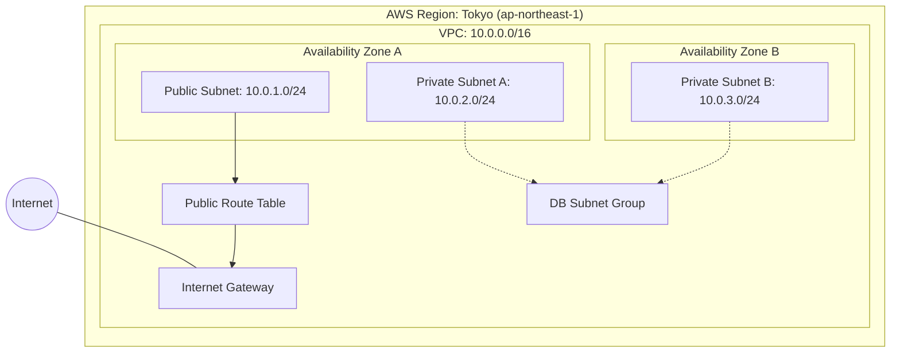

# Project 01 — AWS Network Architecture

## Architecture Diagram

## Architecture Overview

This project defines a foundational AWS network using Terraform.

- **VPC:** Provides an isolated virtual network.
- **Public Subnet:** Uses a route table with a default route to the Internet Gateway.
- **Private Subnets:** Located in two Availability Zones and have no direct route to the Internet Gateway.
- **DB Subnet Group:** Groups the two private subnets for potential future RDS deployment.

## Current Implementation Status

The Terraform configuration has passed local formatting and validation checks.

The infrastructure has not yet been deployed to AWS.

EC2 instances, RDS databases, and NAT Gateways are not currently included.
