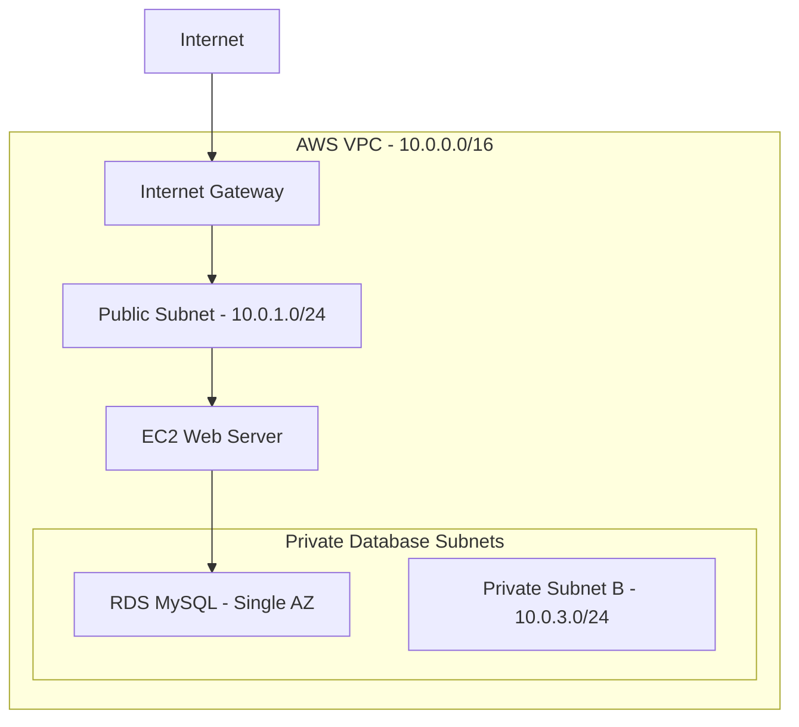

# Japan Market Infrastructure — Architecture

## Architecture Notes

- Region: ap-northeast-1 (Tokyo)
- EC2: Public subnet
- RDS: Private database subnets
- Database access: Restricted to the web security group
- Deployment status: Terraform validated, AWS deployment pending
